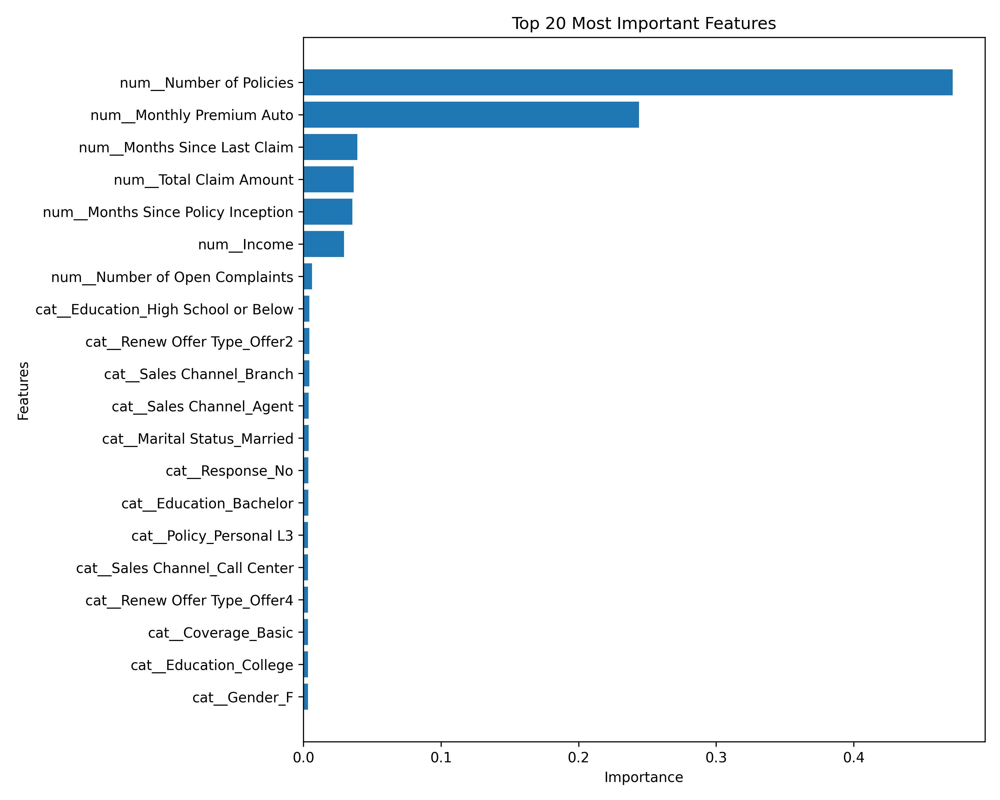

💰 Customer Lifetime Value Prediction

Predict the Customer Lifetime Value (CLV) of insurance customers using Machine Learning and an interactive Streamlit dashboard.

🚀 Live Demo

👉 Streamlit App: (Add your deployment link here)

📌 Project Overview

Customer Lifetime Value (CLV) is one of the most important business metrics that estimates the total revenue a customer is expected to generate during their relationship with a company.

This project uses Machine Learning to predict CLV based on customer demographics, policy details, income, claims, and other business features.

✨ Features
📊 Interactive Streamlit Dashboard
🤖 Machine Learning Prediction
📈 Analytics Dashboard
🔍 Exploratory Data Analysis
⚙ Hyperparameter Tuned Model
🎯 Customer Value Categorization
📉 Feature Importance Visualization
📂 Dataset

IBM Marketing Customer Value Analysis Dataset

9,134 Customers
24 Features
Target Variable:
Customer Lifetime Value
🛠 Tech Stack
Python
Pandas
NumPy
Scikit-learn
Streamlit
Matplotlib
Seaborn
Joblib
🤖 Machine Learning Workflow
Data Collection
       │
       ▼
Data Cleaning
       │
       ▼
Exploratory Data Analysis
       │
       ▼
Feature Engineering
       │
       ▼
Model Training
       │
       ▼
Hyperparameter Tuning
       │
       ▼
Prediction
       │
       ▼
Deployment

📊 Model Performance
Metric	Score
R² Score	0.6954
MAE	1468.01
RMSE	3961.93

📷 Project Screenshots
🏠 Home Page

📈 Prediction

📊 Analytics Dashboard

🔥 Feature Importance



📁 Project Structure


## 📁 Project Structure

```text
Customer-Lifetime-Value-Prediction
│
├── app.py
├── README.md
├── requirements.txt
├── .gitignore
│
├── 01_data_loading.py
├── 02_data_preprocessing.py
├── 03_exploratory_data_analysis.py
├── 04_model_training.py
├── 05_advanced_model_training.py
├── 06_hyperparameter_tuning.py
│
├── data/
│   └── WA_Fn-UseC_-Marketing-Customer-Value-Analysis.csv
│
├── models/
│   └── tuned_model.pkl
│
├── images/
│   ├── home.png
│   ├── prediction.png
│   ├── analytics.png
│   ├── feature_importance.png
│   ├── clv_distribution.png
│   ├── income_distribution.png
│   ├── coverage.png
│   ├── vehicle_class.png
│   └── correlation_heatmap.png 

 
⚡ Installation

pip install -r requirements.txt

streamlit run app.py


👨‍💻 Developer

Ashi Saini

Machine Learning Enthusiast

Python • Data Science • Machine Learning • Streamlit