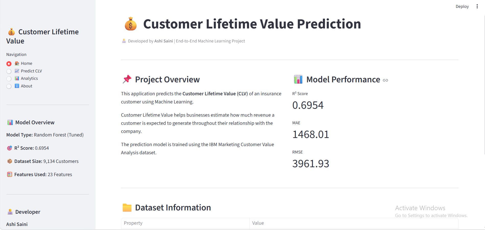
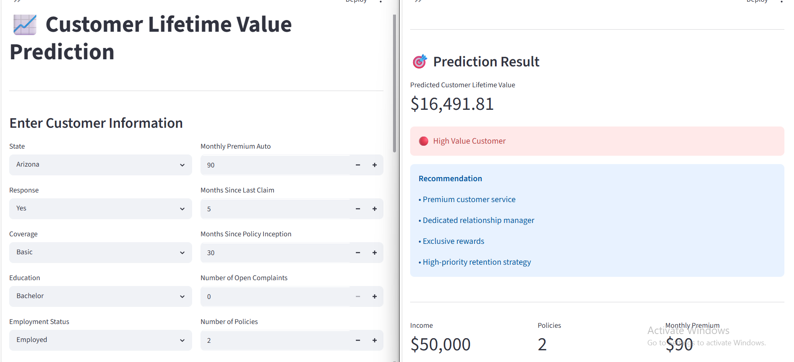
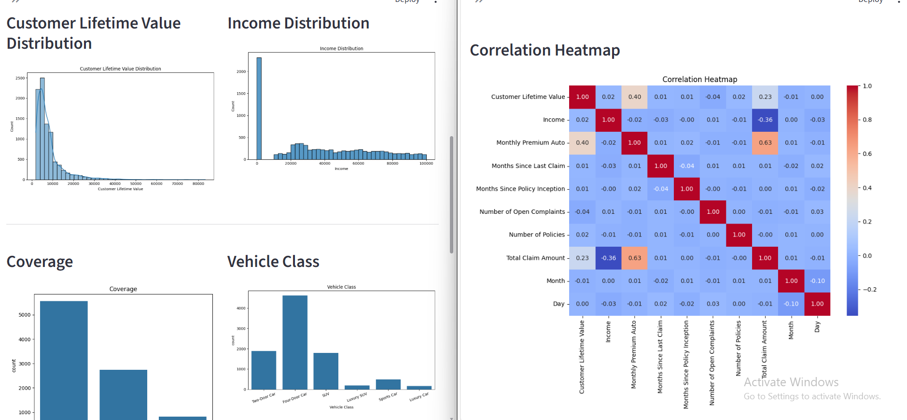
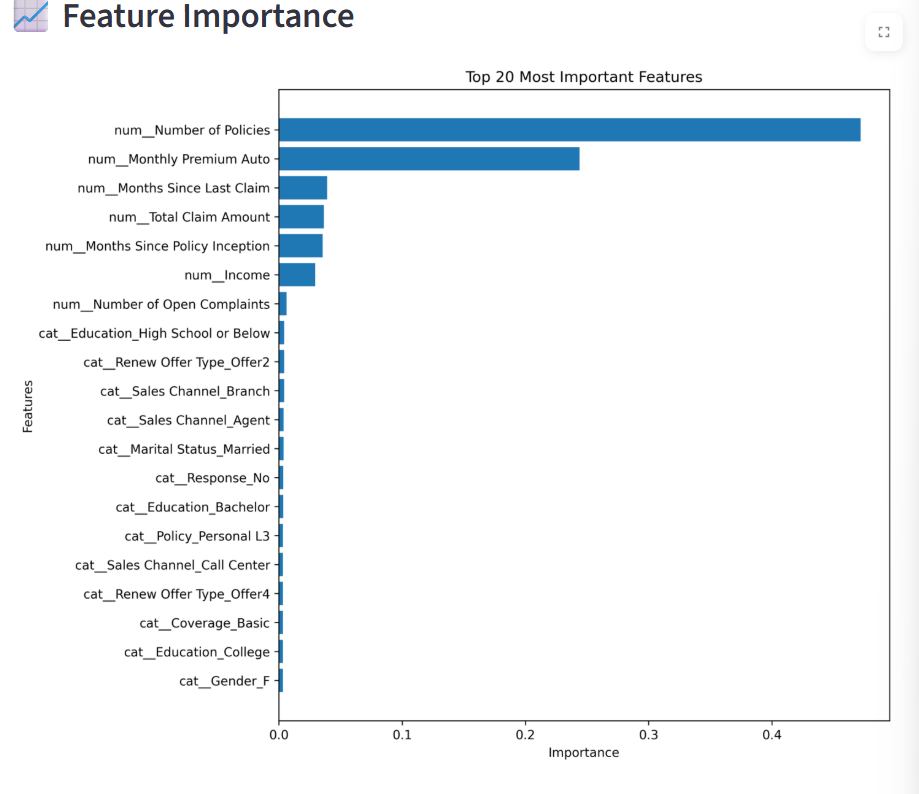

# 💰 Customer Lifetime Value Prediction

An end-to-end Machine Learning project that predicts **Customer Lifetime Value (CLV)** using a **Random Forest Regressor** with **Hyperparameter Tuning** and an interactive **Streamlit Dashboard**.

This project helps businesses estimate the long-term value of customers, enabling better marketing strategies, customer retention, and revenue optimization.

---

## 🚀 Live Demo

🔗 **Streamlit App:** https://ml-customer-lifetime-value-prediction.streamlit.app/

---

## 📌 Project Overview

Customer Lifetime Value (CLV) is one of the most important business metrics that estimates the total revenue a customer is expected to generate throughout their relationship with a company.

This application predicts the lifetime value of an insurance customer using demographic information, policy details, claims history, and other customer attributes.

The project demonstrates a complete Machine Learning workflow from data preprocessing to deployment.

---

## ✨ Key Features

- 📊 Interactive Streamlit Dashboard
- 🤖 Machine Learning-based CLV Prediction
- 📈 Exploratory Data Analysis (EDA)
- ⚙️ Hyperparameter Tuning using RandomizedSearchCV
- 🌲 Random Forest Regression Model
- 📉 Feature Importance Visualization
- 📋 Business-Friendly Prediction Results
- 🎯 Customer Value Segmentation

---

## 📂 Dataset

**Dataset:** IBM Marketing Customer Value Analysis

### Dataset Summary

| Property | Value |
|----------|------:|
| Records | 9,134 |
| Features | 24 |
| Target Variable | Customer Lifetime Value |

The dataset contains customer demographics, insurance policy information, claim history, income, vehicle details, and marketing response data.

---

## 🛠️ Technologies Used

| Category | Tools |
|----------|-------|
| Programming Language | Python |
| Data Analysis | Pandas, NumPy |
| Machine Learning | Scikit-learn |
| Visualization | Matplotlib |
| Deployment | Streamlit |
| Model Saving | Joblib |

---

## 🤖 Machine Learning Workflow

```
Data Collection
       │
       ▼
Data Preprocessing
       │
       ▼
Exploratory Data Analysis
       │
       ▼
Feature Engineering
       │
       ▼
Model Training
       │
       ▼
Hyperparameter Tuning
       │
       ▼
Feature Importance Analysis
       │
       ▼
Streamlit Deployment
```

---

## 📊 Model Performance

| Metric | Score |
|---------|------:|
| R² Score | **0.6954** |
| Mean Absolute Error (MAE) | **1468.01** |
| Root Mean Squared Error (RMSE) | **3961.93** |

---

# 📷 Application Preview

## 🏠 Home Dashboard



---

## 📈 Customer Lifetime Value Prediction



---

## 📊 Analytics Dashboard



---

## 📉 Feature Importance



---

# 📁 Project Structure

```text
Customer-Lifetime-Value-Prediction
│
├── app.py
├── README.md
├── requirements.txt
├── .gitignore
│
├── 01_data_loading.py
├── 02_data_preprocessing.py
├── 03_eda.py
├── 05_advanced_model_training.py
├── 06_hyperparameter_tuning.py
├── 07_feature_importance.py
│
├── data/
│   └── WA_Fn-UseC_-Marketing-Customer-Value-Analysis.csv
│
├── models/
│   └── tuned_model.pkl
│
├── images/
│   ├── home.png
│   ├── prediction.png
│   ├── analytics.png
│   ├── feature_importance.png
│   ├── clv_distribution.png
│   ├── income_distribution.png
│   ├── coverage.png
│   ├── vehicle_class.png
│   └── correlation_heatmap.png
│
└── LICENSE (Optional)
```

---

# ⚡ Installation

Install dependencies

```bash
pip install -r requirements.txt
```

Run the application

```bash
streamlit run app.py
```

---

# 🎯 Future Improvements

- XGBoost & LightGBM implementation
- Advanced feature engineering
- Interactive Plotly visualizations
- Customer segmentation dashboard
- Cloud deployment enhancements
- SHAP explainability for model predictions

---

# 👨‍💻 Developer

## Ashi Saini

Machine Learning & Data Science Enthusiast

**Skills**

- Python
- Machine Learning
- Data Analysis
- Scikit-learn
- Streamlit
- Pandas
- NumPy

---


